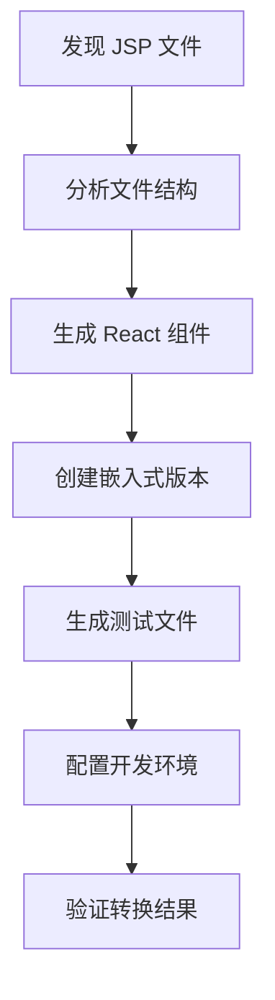

# JSP2React AI Agent

一个基于 AI 的渐进式 JSP 转 React 迁移工具，专注于实用性和可验证性。

## 🌟 特性

- **🤖 AI 驱动**: 使用先进的 LLM 进行智能代码转换
- **📈 渐进式迁移**: 支持 JSP 和 React 混合运行
- **🔍 智能分析**: 自动分析 JSP 文件结构和依赖关系
- **🧪 自动测试**: 生成测试文件确保转换质量
- **⚡ 即开即用**: 转换后的页面可以直接运行
- **🛠️ 简化架构**: 相比原始复杂代码，大幅简化了 AI 服务调用

## 🚀 快速开始

### 1. 环境准备

```bash
# 克隆项目
git clone https://github.com/aise-workshop/jsp2react-agent
cd jsp2react-agent

# 安装依赖
npm install

# 配置 AI 服务（选择其一）
export DEEPSEEK_TOKEN="your-deepseek-token"
export GLM_API_KEY="your-glm-api-key"
export OPENAI_API_KEY="your-openai-api-key"
```

### 2. 运行演示

```bash
# 运行内置演示
npm run demo

# 查看转换结果
cd fixtures/target
npm install
npm run dev
```

### 3. 转换自己的项目

```bash
# 分析现有 JSP 项目
npm run analyze -- --source /path/to/your/jsp/project

# 执行转换
npm run convert -- --source /path/to/your/jsp/project --target /path/to/react/project

# 运行测试
npm test
```

## 📋 命令行工具

### `jsp2react convert`

转换 JSP 项目为 React：

```bash
jsp2react convert [options]

Options:
  -s, --source <path>   源 JSP 项目路径 (default: "./fixtures/source")
  -t, --target <path>   目标 React 项目路径 (default: "./fixtures/target")
  -v, --verbose         显示详细输出
  --dry-run            试运行，不实际写入文件
```

### `jsp2react analyze`

分析 JSP 项目结构：

```bash
jsp2react analyze [options]

Options:
  -s, --source <path>   源 JSP 项目路径 (default: "./fixtures/source")
  -v, --verbose         显示详细输出
```

### `jsp2react setup`

设置开发环境：

```bash
jsp2react setup [options]

Options:
  -t, --target <path>   目标 React 项目路径 (default: "./fixtures/target")
```

### `jsp2react demo`

运行演示转换：

```bash
jsp2react demo [options]

Options:
  -v, --verbose         显示详细输出
```

## 🏗️ 架构设计

### 核心组件

1. **SimpleAIService**: 简化的 AI 服务，支持多种 LLM 提供商
2. **JSPToReactAgent**: 主要的转换 Agent，负责整个迁移流程
3. **TestRunner**: 自动化测试工具，验证转换结果

### 转换流程



### 渐进式迁移

工具支持两种运行模式：

1. **独立模式**: 完全的 React 应用
2. **嵌入模式**: React 组件嵌入到现有 JSP 页面

## 🔧 配置

### 环境变量

```bash
# DeepSeek API
DEEPSEEK_TOKEN=your-token

# GLM API  
GLM_API_KEY=your-key
# 或
GLM_TOKEN=your-token

# OpenAI API
OPENAI_API_KEY=your-key
```

### 项目结构

```
jsp2react-agent/
├── src/
│   ├── core/
│   │   ├── SimpleAIService.js     # 简化的 AI 服务
│   │   └── JSPToReactAgent.js     # 主要转换 Agent
│   ├── tools/
│   │   └── TestRunner.js          # 测试运行器
│   ├── cli.js                     # CLI 工具
│   └── test.js                    # 测试脚本
├── fixtures/
│   ├── source/                    # 示例 JSP 项目
│   └── target/                    # 转换后的 React 项目
└── package.json
```

## 🧪 测试

```bash
# 运行所有测试
npm test

# 详细输出
npm test -- --verbose

# 只运行特定测试
npm run analyze
npm run convert -- --dry-run
```

## 📊 转换示例

### JSP 输入

```jsp
<%@ taglib uri="http://java.sun.com/jsp/jstl/core" prefix="c" %>
<html>
<head>
    <title>Posts</title>
    <link rel="stylesheet" href="/css/styles.css">
</head>
<body>
    <div class="max_width_400">
        <c:forEach items="${posts}" var="post">
            <h3>${post.title}</h3>
            <p>${post.postedText}</p>
            <a href="posts/${post.postId}">Continue</a>
        </c:forEach>
    </div>
</body>
</html>
```

### React 输出

```tsx
import React from 'react';

interface Post {
  postId: number;
  title: string;
  postedText: string;
}

interface PostsProps {
  posts: Post[];
}

const Posts: React.FC<PostsProps> = ({ posts = [] }) => {
  return (
    <html>
      <head>
        <title>Posts</title>
        <link rel="stylesheet" href="/css/styles.css" />
      </head>
      <body>
        <div className="max_width_400">
          {posts.map((post) => (
            <div key={post.postId}>
              <h3>{post.title}</h3>
              <p>{post.postedText}</p>
              <a href={`posts/${post.postId}`}>Continue</a>
            </div>
          ))}
        </div>
      </body>
    </html>
  );
};

export default Posts;
```

## 🤝 相比原始代码的改进

1. **简化 AI 服务**: 移除了复杂的日志系统，保留核心功能
2. **统一 API 调用**: 使用标准 fetch API 替代多个 SDK
3. **专注核心功能**: 专门针对 JSP 转 React 的场景优化
4. **更好的错误处理**: 简化但更可靠的错误处理机制
5. **即开即用**: 转换后的代码可以直接运行和测试

## 📝 许可证

MIT License

## 🙋‍♂️ 贡献

欢迎提交 Issue 和 Pull Request！
